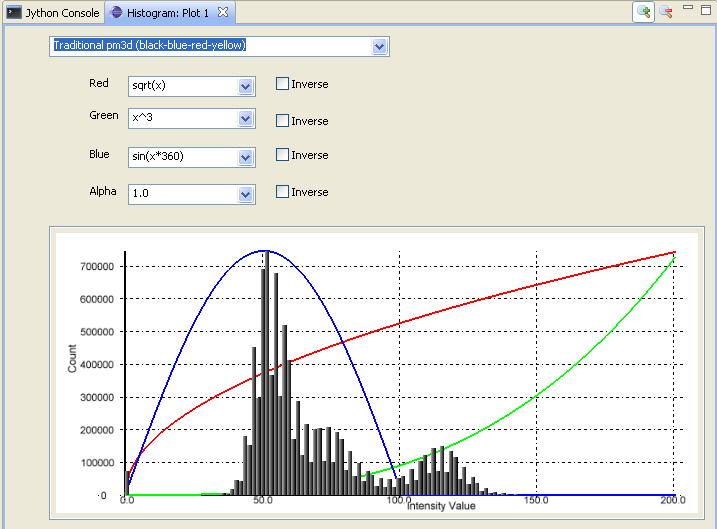
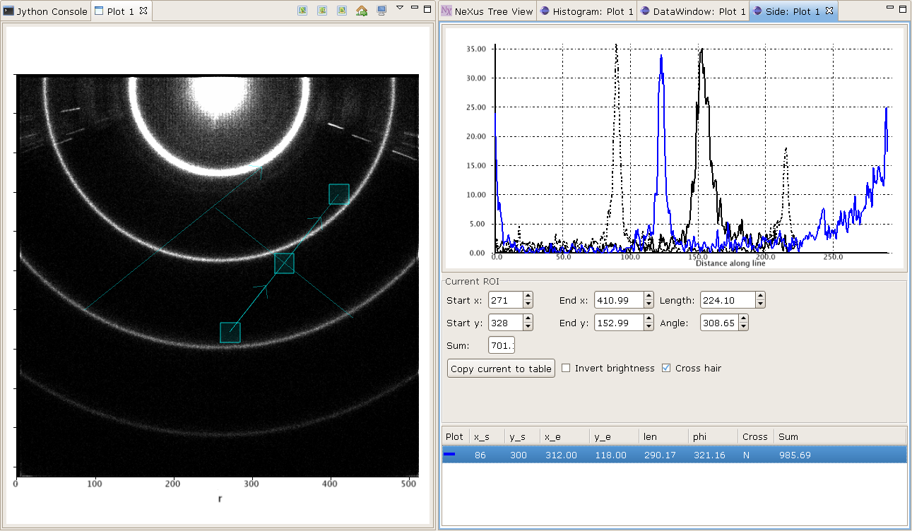
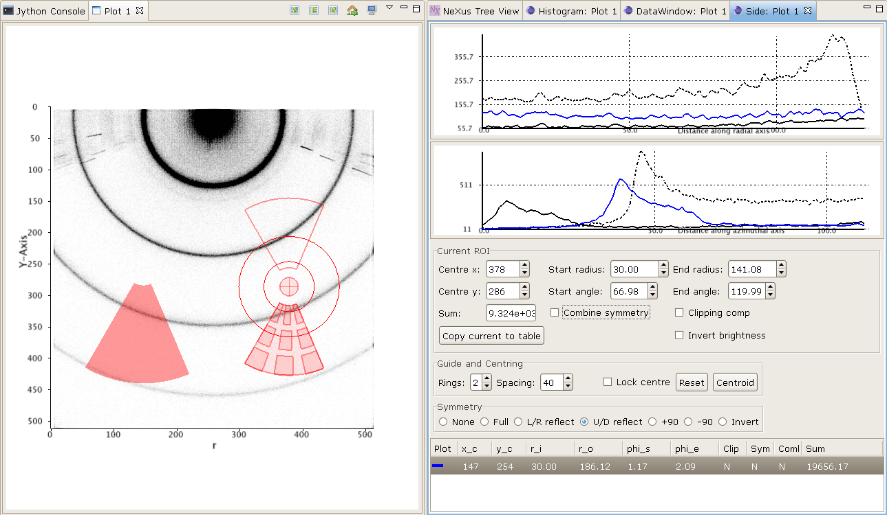

Plot server
===========
The plot server sits on the command server and acts an intermediary between
the command server and the GUI clients. GUI information and plot data can be
passed back and forth. It also passes NeXus trees.

There is a ``PlotServer`` interface defined and the initial implementation
was a pure CORBA setup using GDA's ``DeviceBase`` class. On the GDA server
side (at the moment this is in the uk.ac.gda.core hierarchy), there's a
``PlotServerBase`` class which implements the ``PlotServerDevice interface``
which is a joint interface that combines ``PlotServer`` and GDA's ``Device``.

On the client side, a OSGi service ties the client to the server. If such a
service is unavailable, a ``SimplePlotServer`` is created. This class fulfils
the ``PlotServer`` interface and provides a local, simplified server that does
not communicate with anything else. This class contains two !HashMaps to store
the GUI information and plot data. It is also a delegate of ``PlotServerBase``.

The ``PlotServer`` interface specifies methods to obtain GUI state, and get and
set plot data. It also notifies clients to update their GUI and plot data.

GUI state information is held in a ``GuiBean`` which is a ``HashMap`` of
serializable objects indexed by key strings. Objects held in a ``GuiBean``
should be as small as possible as these beans will be sent back to the server
and then that may send beans on to other clients.

Plot data is held in a ``DataBean`` - see section below. This class allows plot
data, axes definitions and NeXus trees to be accumulated and aggregated. The
axis mapping information is held in an ``AxisMapBean`` which comprises an array
of ``axisID`` strings and a map mode. The mapping information is combined with
a dataset to form a ``DataSetWithAxisInformation`` class. A ``DataBean``
comprises a collection of ``DataSetWithAxisInformation`` objects together with
a ``HashMap`` of axis datasets and a collection of NeXus trees.  

Before sending any plot data, a ``GuiBean`` needs to be send to specify what
mode of plotting should be executed on the data received! This order is
mandatory. See below for a list of modes.

There are (at present) two axis map modes: DIRECT for independent (or separable)
axes and FULL for dependent (or inseparable) axes. The distinction is that the
DIRECT mode specifies a single dimension's index mapping so each dimension in a
dataset is independent and separable. For example, the (x,y,z) values directly
depend on indexes (i,j,k) so when we plot scalarfield(x,y,z) then we need one
scalarfield array (indexed by [i,j,k]) and three axis datasets (xaxis[i], yaxis[j], zaxis[k]).

A simple 3D plot example would look like this::

    # sfield is a 3D dataset
    # xaxis, yaxis, zaxis are 1D datasets

    import uk.ac.diamond.scisoft.analysis.plotserver.DataBean

    plotData = DataBean()                         # create new data bean
    plotData.addAxis(AxisMapBean.XAXIS, xaxis)    # stuff axis datasets
    plotData.addAxis(AxisMapBean.YAXIS, yaxis)
    plotData.addAxis(AxisMapBean.ZAXIS, zaxis)

    amb = AxisMapBean(AxisMapBean.DIRECT)         # create new DIRECT axis mapping bean
    amb.setAxisID([AxisMapBean.XAXIS, AxisMapBean.YAXIS, AxisMapBean.ZAXIS])
                                                  # list the axis datasets' names

    scalar = DataSetWithAxisInformation()         # create data and axis-mapping container
    scalar.setAxisMap(amb)                        # set axis-mapping (NB need to set this before setting data)
    scalar.setData(sfield)                        # set data

    plotData.addData(scalar)                      # add dataset

    ps = finder.find("plot_server")               # find plot server
    guiBean = GuiBean()                           # create a GUI bean
    guiBean[GuiParameters.PLOTMODE] = "3DVolume"
                                                  # specify the plotting mode
    ps.updateGui("Plot View", guiBean)            # send the GUI bean
    ps.setData("Plot View", plotData)             # fire plot data to it

The FULL mode is used when the indexes are intertwined to create new
coordinates. For example, (x,y) maps to (r,phi) in an inseparable manner so for
a 2D example, scalarfield (indexed by [i,j]) needs 2 accompanying axis 2D
datasets (xaxis[i,j] and yaxis[i,j])::

    # sfield is a 2D dataset
    # xaxis, yaxis are 2D datasets

    from uk.ac.diamond.scisoft.analysis.plotserver import *

    plotData = DataBean()                         # create new data bean
    plotData.addAxis(AxisMapBean.XAXIS, xaxis)    # stuff axis 2D datasets
    plotData.addAxis(AxisMapBean.YAXIS, yaxis)

    amb = AxisMapBean(AxisMapBean.FULL)           # create new FULL axis mapping bean
    amb.setAxisID([AxisMapBean.XAXIS, AxisMapBean.YAXIS])
                                                  # list the axis datasets' names

    scalar = DataSetWithAxisInformation()         # create data and axis-mapping container
    scalar.setAxisMap(amb)                        # set axis-mapping (NB need to set this before setting data)
    scalar.setData(sfield)                        # set data

    plotData.addData(scalar)                      # add dataset
    guiBean = GuiBean()                           # create a GUI bean
    guiBean[GuiParameters.PLOTMODE] = GuiplotMode.TWOD
                                                  # specify the plotting mode
    ps = finder.find("plot_server")               # find plot server
    ps.updateGui("Plot View", guiBean)            # send the GUI bean to the client
    ps.setData("Plot View", plotData)             # fire plot data to it

NB for 1D datasets, the two modes are equivalent.

The GUI can be sent additional information to change the presentation of the
plot or the state of any analyses. Here is an example of setting such a parameter::

    guiBean = GuiBean()
    guiBean[GuiParameters.TITLE] = "My graph title"
    a.updateGui("Plot View", guiBean)

Server side
-----------
As seen in the above section, the plot server object has methods to set the
plot and GUI data. The base class extends a !DeviceBase and implements the plot
server interface that specifies said methods.

There is a helper class called RCPPlotter to simplify access to the plot server.
It sends datasets to be plotted to a plot view called "Plot 1".

Client side
-----------
Any plotting GUI needs to find the instance of the plot server then add itself
to that server's list of Observers. In doing so, it needs to implement the
IObserver interface and contain an update() method to receive update
notifications from the plot server. The updates that pertain to the GUI (new
data or GUI beans) are handled and if the GUI wants to publish GUI information,
it calls the plot server's updateGui method.

Currently, the [wiki:SciRCPPlotView PlotView] class is a RCP !ViewPart that
implements our plotting GUI.

Client/Server information
-------------------------
Apart from the data been passed from server to client, GUI information can be
sent both ways. As mentioned above, a !GuiBean is used to achieve this by
encapsulating any client state information.

The !GuiParameter class holds:
 PLOTMODE::
  One of the following constant from !GuiPlotMode class
  * ONED for XY 1D scalar data plot
  * TWOD for Image plot 2D scalar data
  * SURF2D for Surface plotting 2D scalar data
  * ONED_THREED" for 3D Plotting many 1Ds
  * "VOLUME3D" for Volume rendering 3D scalar data, '''not implemented'''
  * "SERIES2D" for plotting more than one 2D image, '''not implemented'''

 TITLE::
  Title of plot

 ROIDATA::
  A region of interest object
  * Linear ROI
  * Rectangular ROI
  * Sector ROI

 ROILISTDATA::
  A homogeneous list of ROI objects

 PLOTID::
  A universal (or nearly) unique identifier for each plot client. This is
  generated by each client on its initialization and used to filter out
  updates from the plot server that refer to itself.

 FILESELECTEDLIST::
  A list of names of the files selected by a plot client with the image
  explorer view.

Data Bean
---------
A !DataBean holds (bulk) data to be passed from server to client. It holds a
HashMap of axes defined by names and datasets, a collection of
!DataSetWithAxisInformation and a collection of !NexusTree. It has the
following methods:

 * addAxis(String, !DataSet)
 * addData(!DataSetWithAxisInformation)
 * addNexusTree(INexusTree)
 * getAxis(String) returns a !DataSet
 * getData() returns a collection of !DataSetWithAxisInformation
 * getNexusTrees() returns a collection of !INexusTree
 * setData(Collection<!DataSetWithAxisInformation>)
 * setNexusTrees(Collection<INexusTree>)

Jython
------
The plot client regularly updates the plot server with GUI information. This
can be obtained from the server using the RCPPlotter class::

    from uk.ac.diamond.scisoft.analysis.plotserver import *
    
    # grab a GUI bean
    gb = RCPPlotter.setGuiBean("Plot 1")
    
The GuiBean is a dictionary object with a set of possible keys listed in the
GuiParameters class. :obj:`None` is returned if there is no dictionary present. You
can add in new entries or overwrite existing ones. Modified GUI beans can be
pushed back to the server::

    RCPPlotter.setGuiBean("Plot 1", gb)

and the client will respond appropriately to the updated GUI information. The
keys for the dictionary are listed as strings in the GuiParameters class::

    dir(GuiParameters)

Plot View
=========
The plot view is the main window where all graphical plotting is displayed.
Plot view is a generic plotting UI, that allows graphical plotting of different
scalar dataset types. Currently supported scalar type sets are:

 * multiple 1D scalar

  .. figure:: images/plot1d.png

 * multiple 1D scalar as a series in 3D

  .. figure:: images/plot1d_3d.png

 * 2D scalar as image

  .. figure:: images/plot2d.png

 * 2D scalar as 3D surface plot
 
  .. figure:: images/plot2d_surf.png

It is possible to have more than one instance of the Plot view open and plot to
simultaneously and usually they are named Plot 1, Plot 2, ..., Plot n. The name
is important since it is used to send data to via the Jython terminal.

Jython
------
Plotting any data in any form to one of the Plot Views can be done from
the server using the RCPPlotter class:

 * 1D scalar plots::

    RCPPlotter.plot("Plot 1", xAxisDataSet, yAxisDataSet)

 * multiple 1D scalar plots as 3D series::

    RCPPlotter.stackPlot("Plot 1", xAxisDataSet, [yAxisDataSet1, yAxisDataSet2,...,yAxisDataSetn])

   or in case of multiple x-axis::
   
    RCPPlotter.stackPlot("Plot 1", [xAxisDataSet1, xAxisDataSet2, ..., xAxisDataSetn],
                         [yAxisDataSet1, yAxisDataSet2, ..., yAxisDataSetn])
   
   or if the z axis should be specified as well::

    RCPPlotter.stackPlot("Plot 1", xAxisDataSet,
                         [yAxisDataSet1, yAxisDataSet2, ..., yAxisDataSetn],
                         zAxisDataSet)
   
   combination of the previous two::
    
    RCPPlotter.stackPlot("Plot 1", [xAxisDataSet1, xAxisDataSet2, ..., xAxisDataSetn],
                         [yAxisDataSet1, yAxisDataSet2, ..., yAxisDataSetn],
                         zAxisDataSet)

 * 2D scalar image plots::

    RCPPlotter.imagePlot("Plot 1",imageDataSet)

 * 2D scalar 3D surface plots::

    RCPPlotter.surfacePlot("Plot 1",imageDataSet) 

Both 2D image plots and 2D surface plots will open automatically a histogram
view panel that is associated to the plot view. Through the histogram view it
is possible to control the mapping of the data values in the plotted image to
the different colour channels.

 
2D Image Plot Profiles
======================
The plot profile tools inhabit a side plot panel. The tools are activated by
clicking on the toolbar buttons in the plot view. These buttons become visible
when an image is plotted.

The coordinate system used in the image plot is in pixels starting from the
upper left at (0,0) with x increasing when moving left and y increasing moving
down. Angles are measured from the horizontal and increases when moving
clockwise.

There are three profile tools: line, box and sector tools. Each allows the
selection of multiple regions of interest (ROIs). The purpose of the ROIs is
to allow profiles of the image within a ROI to be plotted. These plots reside
in the top part of the panel.

   Line profile tool

When a profile tool is active, a region of interest can be specified using the
mouse to click and drag out a ROI. The ROI is shown as an overlay on the
image. Once done, the ROI can be further manipulated with use of its handle
areas. The brightness of the ROI outline can be inverted using the
"Invert brightness" checkbox to improve its contrast with the image.

The handle areas operate in two ways: a left click on an area enables that
area, and the part of the ROI to which it is attached, to be moved; a right
click (or alternatively, simultaneous holding a shift key and left clicking)
cause some type of rotation to occur. Generally, a central handle area allows
translation of the ROI  or rotation about that handle area. A handle area at a
vertex will allow resize of the ROI (leaving the opposing vertex fixed) or
rotate about the opposite vertex.

Once a profile is plotted, it can be added to a store using a toolbar button
above the plotting area. The oldest item in the store also can be removed using
a toolbar button. There are separate stores for each type of profile.

Each linear ROI can have an optional cross, linear ROI defined to form a
cross-hair. This cross ROI is a perpendicular bisector of the same length as its
partner. The line profile is plotted in the graph and dashed lines are used for
cross ROIs.

.. figure:: images/bprof01.png

   Box profile tool

A rectangular ROI defined in the box profile tool is defined by its starting
point, width (major axis length), height (minor axis length) and orientation
angle of its major axis. The upper graph shows the integration values over
the minor axis as the position on the major axis is varied. The lower graph
shows the converse. There is a "clipping comp" checkbox available that attempts
to compensate for the situation where a ROI lies partially outside the image,
i.e. the ROI is clipped by the boundaries of the image. In this case, some of
the integration values are subdued by the lack of pixels (they are represented
by zeros in the ROI) outside the image and the compensation scheme boosts those
values by the ratio of the full integration length to the clipped length. Note
that this compensation can introduce extrapolation errors and is prone to
erroneous results where the clipped length is short and when the pixel values
are noisy. 

The sector ROI is distinguished by the necessity of defining a centre point.
Once defined, the sector ROI operates in a manner dictated by a polar
coordinate system (radius *r*, angle *phi*) so rotation operations on the
handle areas act like translations in polar coordinates. Also, the angular
symmetry can be selected for a sector ROI that can alter the ROI or make a 
copy subject selected symmetry:

 *None*
  No symmetry
 *Full*
  360 degrees
 *L/R reflect*
  Left/right reflection
 *U/D reflect*
  Up/down reflection
 *+90*
  Rotate 90 degrees clockwise
 *-90*
  Rotate 90 degrees anti-clockwise
 *Invert*
  Invert through centre

The upper graph shows the azimuthal integration as the radius is varied and the
lower graph shows the radial integration as the azimuth angle is changed.
Ticking the "combine symmetry" checkbox allows any separate symmetry-selected
ROI to be combined in the profile plots, otherwise the separate ROI is plotted
as dashed lines.

The current ROI can also be modified using the spinner widgets that are
displayed in the centre part of the side plot panel. Each spinner is editable
and can alter a parameter of the ROI. Once the ROI has been defined, it can be
saved and then displayed in the table at the bottom of the panel.

   Sector profile tool

Multiple ROIs can have their profiles plotted by clicking on the checkboxes in
the table. Any ROI in the table can be selected and replace the current ROI,
copied in place of the current ROI or deleted using a right mouse click
anywhere on the row of the ROI.

ROI objects
-----------
The regions of interest defined are:
 *LinearROI*
   A line segment defined by its starting point, length and angle
 *RectangularROI*
   A rectangle defined by its starting point, width, height and 
   angle
 *SectorROI*
   A sector defined by its centre point, bounds on radius and azimuthal angle

Jython
------
The current ROI and any ROIs stored in the table are sent via a GUI bean back
to the plot server. A GUIBean is a Jython dictionary object and is obtained as
follows::

  from uk.ac.diamond.scisoft.analysis.dataset.roi import *
  
  gb = RCPPlotter.getGuiBean("Plot 1")

The current ROI is held in the GUIBean object under the key "ROIData" and the
table of ROIs under the key "ROIDataList". The values of the keys depend on
which plot profile tool is active.

When the line profile tool is being used, the ROIData item is a LinearROI object
and any stored ROIs are held in a Jython list of LinearROIs::

  cr = gb["ROIData"] # or gb[GuiParameters.ROIDATA]
  
  # print current ROI's starting point, length and angle (in radians)
  print cr.point, cr.length, cr.angle
  
  lr = gb["ROIDataList"]
  
  # get first item
  ra = lr[0]
  
  print ra.length, ra.angleDegrees
  
  # copy ROI from list
  roi = gb["ROIDataList"][0].copy()
  
  # modify ROI
  roi.setPoint(100,50)
  
  # create new bean and add ROI
  gbb = GuiBean()
  list = LinearROIList()
  list.add(roi)
  gbb["ROIDataList"] = list

  # push bean back
  RCPPlotter.setGuiBean("Plot 1", gbb)

The ROIs obtained from the client can be used with image datasets to calculate
profile datasets on the server::

  # for a linear ROI lroi, image dataset and a step size of 0.5 pixels,
  # lprof is a list of datasets. The first element is the profile along the
  # line and the second element is along the perpendicular bisector (if the
  # crosshair option is set)
  lprof = ROIProfile.line(image, lroi, 0.5) 

