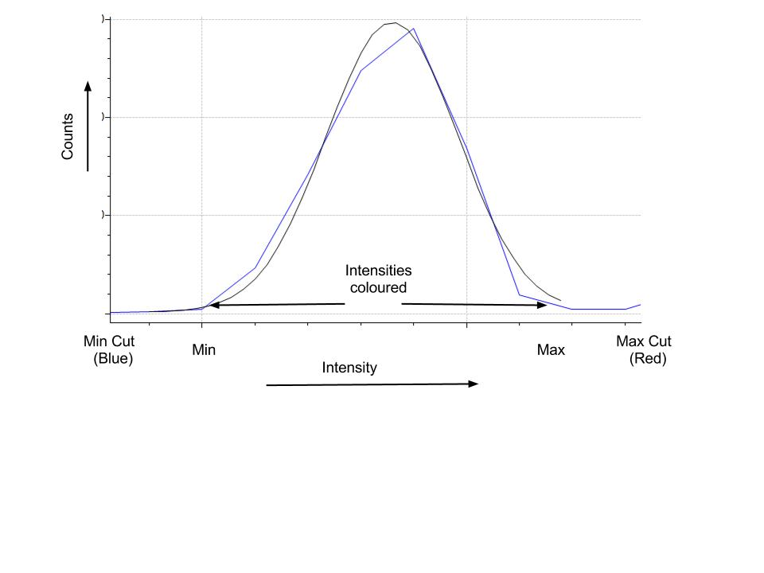
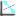
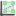

Image Plotting Tools
====================

The image plotting tools appear automatically when an image (two-dimensional data array) is plotted. 
You can choose an image tool by going to the tool action menu: 

.. image:: images/plot-tool-any.png

and choosing the kind of tool you would like. The follow section details with what each of the tools do.

**NOTE** All tools which use regions like lines, boxes and sectors may be run with multiple regions. Many
lines for instance may be drawn by the line profile tool. To add another region click the button for the tool
again.

Color Mapping
-------------

The colour mapping tool is used to adjust how the values of intensity are coloured. The colours are assigned
within a maximum and minimum value for intensity. There are also minimum and maximum cut values, outside these
ranges and a value is considered bad and has a special colour. For instance dead pixels blue and zingers red.

Imagining the plotting the intensities with a normal distribution the colour range of the palette and cut offs
is given by:

Pressing the 'h' key with the plot selected will result in the current max and min for the colour range
being reset.

Line Profile
------------

The line profile tool extracts the intensity along a line and plots it in an xy-plot at the side of the image.
You may use peak fitting and other xy-tools on the xy-plot. So for instance a line may pass through several peaks
and then the peak fitting be used to find the fitted maxima.

Box Profile
-----------

The box profile tool is the integral of vertical and horizontal intensities of a box drawn on the image.
The box may be dragged around the image and multiple 