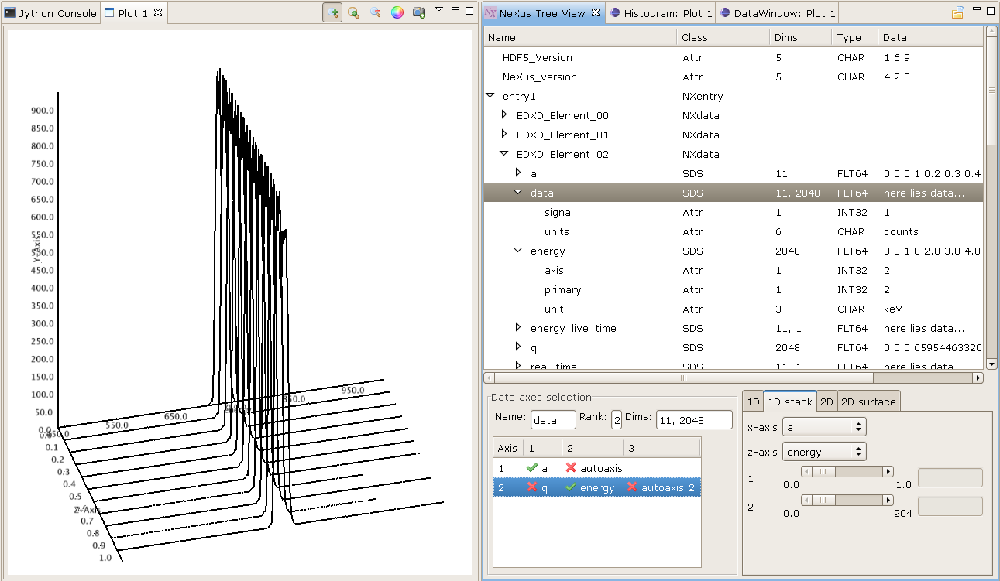

Data Exploration Perspective
============================
This perspective provides the primary way to explore data held in a set of
files. The default layout is divided horizontally into four parts: a project
explorer pane on the left; a central section split vertically into a
editor-holding area where opened files are displayed at the top and a dataset
inspector view below; a plot view; and its accompanying side plot view.

Files can be opened using the File > Open File... menu item. The following file
formats are supported:

   * ``png``, ``gif``, ``jpeg``, ``tiff`` - standard image formats

   * ``adsc`` - ADSC Quantum area series detector format

   * ``crysalis`` - Oxford Diffraction CrysAlis processing software format

   * ``mar`` - Rayonix's MarCCD detector

   * ``pilatus`` - Dectris Pilatus detector version of TIFF 

   * ``cbf`` - Crystallographic Binary Format (IUCR)

   * ``xmap`` - XIA's DXP-xMAP format for x-ray spectra

   * ``srs`` - Daresbury Laboratory's Synchrotron Radiation Source format

   * ``edf`` - European Synchrotron Radiation Source data format for Pilatus images

   * ``binary`` - raw single dataset format

   * ``npy`` - NumPy binary format

   * ``hdf5`` - HDF5 [#HDF5]_ tree format

   * ``nx`` - NeXus [#Nexus]_ tree format

Project Explorer
================
This GUI element provides a way to organise and access sets of data files. A
set of files can be imported to the explorer in a project. To create such a
project, select from the File menu "New > Project... > Data > Data Project"
(or bring up the context menu with a third mouse button click in the Project
Explorer area). Specify a project name, folder and the directory containing
the files. A project will be created with all the files linked in (not copied).

A file listed in the project can be opened in an editor by double clicking on
its row. When many files are opened, the tabs at the top of the editor area can
be used to switch between files - single clicks in the project explorer will
also do the same.

Once a file has been opened, its content can be explored with the dataset
inspector view.

NeXus/HDF5 Editor/View
----------------------
The NeXus [#Nexus]_ file format is a common data storage format for neutron,
x-ray and muon science. HDF5 [#HDF5]_ is one of the underlying file formats
supported and used by the NeXus format as well as being a format in its own
right.

This editor or view allows the data held in a Nexus file to be explored with a
graphical user interface. NeXus files can be loaded into the viewer by clicking
on the toolbar button at the top right of the viewer.

The table-tree representing the Nexus structure can be expanded node by
node using a left mouse click on the node. The columns of the table-tree
display the node name, class, value type, dimensions, value. Right clicking
on the table header will bring up a context menu that allows columns to be
hidden or made visible.

To select an item to plot, double click on a node that belongs to the NXdata.
This will send the data item to the dataset inspector view if it has a signal
attribute. Otherwise, double click on any item of class SDS (scientific data
set) to send that item alone.

   NeXus tree viewer

Dataset Inspector
=================
The dataset inspector provides a means to examine a dataset selected in the
current editor. This view contains an axes selection table, a multi-dimensional
slicer and an inspection type selector. A dataset is considered to be an
N-dimensional array of items where each item is an element or a compound of
elements. The axes selection table allows a choice of datasets to be associated
with dimensions of the dataset and are used as abscissa values for plotting and
displaying values against. By default, at least one integer dataset called
"dim:n" is included per dimension that ranges from 0 to L-1 inclusive where L 
is the length of the dimension.

The slicer allows (hyper-)rectangular subset (or slice) of the dataset to use
selected. Each dimension has an axis name, a slider, a start value display, a
slice length adjuster, a slice step adjuster, and a reset button. The start
position is chosen by moving the slider left or right. The number of items
used and the step between items is adjusted by clicking the arrow buttons or by
entering the desired values.

The final element is the inspection type selector. This allows various
visualisations and examinations to be performed on the sliced dataset. These
are displayed in the plot view, dataset table view or image explorer view.
These displays can be configured to show dimensions by selecting their
corresponding axis from the drop-down combination boxes.

Plot view
=========
The plot view is the main window where all graphical plotting is displayed.
A plot view is a generic plotting UI, that allows graphical plotting of different
scalar dataset types. Currently supported scalar plots are:

 * multiple 1D scalar as lines

  .. figure:: images/plot1d.png

 * multiple 1D scalar as a series of lines in 3D

  .. figure:: images/plot1d_3d.png

 * multiple 1D scalar as points in 2D

  .. figure:: images/pplot2d.png

 * multiple 1D scalar as points in 3D

  .. figure:: images/pplot3d.png

 * 2D scalar as image

  .. figure:: images/plot2d.png

 * 2D scalar as 3D surface plot
 
  .. figure:: images/plot2d_surf.png

It is possible to have more than one plot view open and plot to them
simultaneously and usually they are named Plot 1, Plot 2, ..., Plot n. The name
is important since it is used to send data to via the Jython terminal.

Both 2D image plots, 2D surface plots and 3D points plots will open
automatically a histogram view panel that is associated to the plot view.
Through the histogram view it is possible to control the mapping of the data
values in the plotted image or surface to the different colours.

.. figure:: images/histogram.png

2D Image Plot Profiles
----------------------
The plot profile tools inhabit a side plot panel. The tools are activated by
clicking on the toolbar buttons in the plot view. These buttons become visible
when an image is plotted.

The coordinate system used in the image plot is in pixels starting from the
upper left at (0,0) with *x* increasing when moving left and *y* increasing
moving down. Angles are measured from the horizontal and increases when moving
clockwise.

There are three profile tools: line, box and sector tools. Each allows the
selection of multiple regions of interest (ROIs). The purpose of the ROIs is
to allow profiles of the image within a ROI to be plotted. These plots reside
in the top part of the panel. Note, for compound datasets, only the first
element of each item is analysed by the profile tools. In the case of coloured
images, the red channel is profiled. 

.. figure:: images/lprof01.png

   Line profile tool

When a profile tool is active, a region of interest can be specified using the
mouse to click and drag out a ROI. The ROI is shown as an overlay on the
image. Once done, the ROI can be further manipulated with use of its handle
areas. The brightness of the ROI outline can be inverted using the
"Invert brightness" checkbox to improve its contrast with the image.

The handle areas operate in two ways: a left click on an area enables that
area, and the part of the ROI to which it is attached, to be moved; a right
click (or alternatively, simultaneous holding a shift key and left clicking)
cause some type of rotation to occur. Generally, a central handle area allows
translation of the ROI  or rotation about that handle area. A handle area at a
vertex will allow resize of the ROI (leaving the opposing vertex fixed) or
rotate about the opposite vertex.

Once a profile is plotted, it can be added to a store using a toolbar button
above the plotting area. The oldest item in the store also can be removed using
a toolbar button. There are separate stores for each type of profile.

Each linear ROI can have an optional cross, linear ROI defined to form a
cross-hair. This cross ROI is a perpendicular bisector of the same length as its
partner. The line profile is plotted in the graph and dashed lines are used for
cross ROIs.

.. figure:: images/bprof01.png

   Box profile tool

A rectangular ROI defined in the box profile tool is defined by its starting
point, width (major axis length), height (minor axis length) and orientation
angle of its major axis. The upper graph shows the integration values over
the minor axis as the position on the major axis is varied. The lower graph
shows the converse. There is a "clipping comp" checkbox available that attempts
to compensate for the situation where a ROI lies partially outside the image,
i.e. the ROI is clipped by the boundaries of the image. In this case, some of
the integration values are subdued by the lack of pixels (they are represented
by zeros in the ROI) outside the image and the compensation scheme boosts those
values by the ratio of the full integration length to the clipped length. Note
that this compensation can introduce extrapolation errors and is prone to
erroneous results where the clipped length is short and when the pixel values
are noisy. 

The sector ROI is distinguished by the necessity of defining a centre point.
Once defined, the sector ROI operates in a manner dictated by a polar
coordinate system (radius *r*, angle *phi*) so rotation operations on the
handle areas act like translations in polar coordinates. Also, the angular
symmetry can be selected for a sector ROI that can alter the ROI or make a 
copy subject selected symmetry:

 *None*
  No symmetry
 *Full*
  360 degrees
 *L/R reflect*
  Left/right reflection
 *U/D reflect*
  Up/down reflection
 *+90*
  Rotate 90 degrees clockwise
 *-90*
  Rotate 90 degrees anti-clockwise
 *Invert*
  Invert through centre

The upper graph shows the azimuthal integration as the radius is varied and the
lower graph shows the radial integration as the azimuth angle is changed.
Ticking the "combine symmetry" checkbox allows any separate symmetry-selected
ROI to be combined in the profile plots, otherwise the separate ROI is plotted
as dashed lines.

The current ROI can also be modified using the spinner widgets that are
displayed in the centre part of the side plot panel. Each spinner is editable
and can alter a parameter of the ROI. Once the ROI has been defined, it can be
saved and then displayed in the table at the bottom of the panel.

.. figure:: images/sprof01.png

   Sector profile tool

Multiple ROIs can have their profiles plotted by clicking on the checkboxes in
the table. Any ROI in the table can be selected and replace the current ROI,
copied in place of the current ROI or deleted using a right mouse click
anywhere on the row of the ROI.

All profile plots allow zooming using the left-hand mouse button to drag out
a rectangular area to magnify. A right-hand mouse button click brings up a
dialogue box where there are buttons for switching between linear and
logarithmic scales on the ``y`` axis, undoing previous zooms and resetting the
plot. The initial choice of y axis scale used in all the profile plots is
controlled by the setting found within Windows > Preferences > Scisoft Settings
> Side Plotter.

References
----------
.. [#HDF5] HDF5: http://www.hdfgroup.org/HDF5
.. [#Nexus] NeXus: http://www.nexusformat.org
