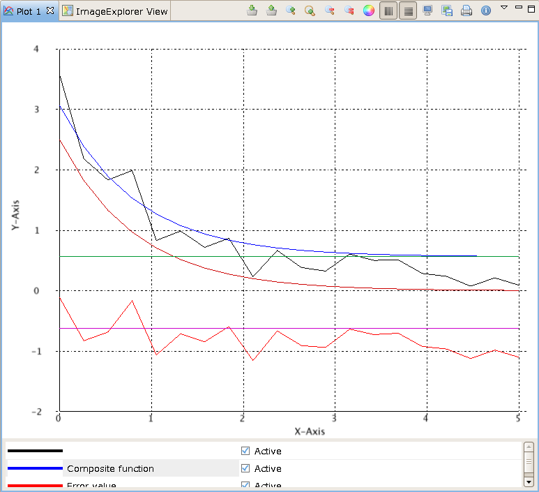

Fitting
=======
The ``fit`` module contains a ``fit.fit`` function and some built-in fitting functions.

Fitting functions
-----------------
The fit function requires fitting functions to be specified. There are a number of built-in
fitting functions defined in ``fit.function`` listed in the table below:

+------------+-------------------------------------+-----------------------------------+
| Name       | Description                         | Parameters                        |
+============+=====================================+===================================+
| offset     | constant offset, :math:`a`          | :math:`a`                         |
+------------+-------------------------------------+-----------------------------------+
| linear     | linear function, :math:`a x + b`    | :math:`a, b`                      |
+------------+-------------------------------------+-----------------------------------+
| quadratic  | quadratic function,                 | :math:`a, b, c`                   |
|            | :math:`a x^2 + b x + c`             |                                   |
+------------+-------------------------------------+-----------------------------------+
| cubic      | cubic function,                     | :math:`a, b, c, d`                |
|            | :math:`a x^3 + b x^2 + c x + d`     |                                   |
+------------+-------------------------------------+-----------------------------------+
| step       | double step profile                 | base, start, end, outer step,     |
|            |                                     | inner step, inner width fraction, | 
|            |                                     | inner offset fraction             |  
+------------+-------------------------------------+-----------------------------------+
| gaussian   | Gaussian profile (normal profile)   | position, FWHM, area              |
+------------+-------------------------------------+-----------------------------------+
| lorentzian | Lorentzian profile (Cauchy or       | position, FWHM, area              |
|            | Breit-Wigner profile)               |                                   |
+------------+-------------------------------------+-----------------------------------+
| pvoigt     | pseudo-Voigt profile                | position, Gaussian FWHM,          |
|            |                                     | Lorentzian FWHM, area, mixing     |
+------------+-------------------------------------+-----------------------------------+
| pearson7   | Pearson VII profile                 | position, FWHM, mixing, area      |
+------------+-------------------------------------+-----------------------------------+

Functions defined in Jython can also be used as long as they conform to a
standard argument signature::

    import scisoftpy as dnp

    def myfunc(p, x, *arg):
        '''p -- list of parameters
        x -- list of coordinate datasets
        arg -- tuple of additional arguments
        '''
        return p[0]*dnp.exp(-p[1]*x[0])

This function uses two parameters defines a negative exponential function. It
can be tested in a line plot::

    x = dnp.linspace(0, 5, 40)               # dataset of 40 coordinate points between 0 and 5
    dnp.plot.line(x, myfunc([3., 1.5], [x])) # plot line of evaluated function

.. figure:: images/negexp.png

 
Fit usage
---------
Once a fitting function (or a set of fitting functions) is chosen, the ``fit``
function can be invoked::
 
    fr = dnp.fit.fit(func, coords, data, p0, bounds=[], args=None, ptol=1e-4, optimizer='local')

where ``func`` is a function or list of functions, ``coords`` is a coordinate
dataset (or list of datasets), ``data`` is a dataset that contains the data to
fit against, ``p0`` is a list of initial parameters, ``bounds`` is a list of
tuples of lower and upper limits, ``args`` is optional arguments, ``ptol`` is
fitting tolerance, and optimizer specifies the underlying methods used to make
the fit.

By default, all parameters are limited to values between -``scisoftpy.floatmax``
and ``scisoftpy.floatmax``. The ``bounds`` list specify how to set each
parameter's limits. ``None`` values in the list indicate the corresponding
parameter is skipped over. Each item in the list can be a single number or a
tuple - a single number is used to set the lower limit. For a tuple, the first
value is the lower limit and, if the tuple has more than one item, the second
value is the upper limit. ``None`` values in a tuple indicate the corresponding
limit is skipped over. Thus if just an upper bound of 12.3 is required then use
``(None, 12.3)``.  These bounds are particularly important when using a global 
optimizer as this reduces the search space significantly.  

By default, a local optimizer is used, which minimises the chi-squared value of 
fit vrs the data, to the nearest local minima.  This means that the fit will not 
necessarily return the best result, however the local techniques are quite fast
if a good start point can be guessed at.  The global techniques take longer, but
are much more likely to find the global minima, however they are slower, and
need to be bounded to work effectively if at all.  The current minimisers 
available are
  
+----------+----------------------------------------------------------------------+
| Name     | Description                                                          |
+==========+======================================================================+
| local    | points to the simplex method                                         | 
+----------+----------------------------------------------------------------------+
| global   | points to the genetic method                                         |
+----------+----------------------------------------------------------------------+
| simplex  | uses the Simplex, or Nelder Mead local optimisation technique        |
+----------+----------------------------------------------------------------------+
| genetic  | uses an implementation of a differential evolution genetic algorithm |
+----------+----------------------------------------------------------------------+

Built-in functions are specified solely by their names; Jython functions are
specified as tuples with each tuple as a pair of function name and number of
parameters. If the aforementioned Jython function was used, it would be
given as ``(myfunc, 2)``. The following example shows a fitting of a composite
function - a negative exponential function that is offset by a constant amount:: 

    x = dnp.linspace(0, 5, 20)
    d = dnp.array([ 3.5733e+00, 2.1821e+00, 1.8313e+00, 1.9893e+00, 8.3145e-01,
        9.8761e-01, 7.1809e-01, 8.6756e-01, 2.3144e-01, 6.6659e-01, 3.8420e-01,
        3.2560e-01, 6.0712e-01, 5.0191e-01, 5.1308e-01, 2.8631e-01, 2.3811e-01,
        7.6472e-02, 2.1317e-01, 9.1819e-02 ])
    fr = dnp.fit.fit([(myfunc, 2), dnp.fit.function.offset], x, d, [2.5, 1.2, 0.1], [(0,4), 0, (-0.2,0.7)])

    print fr  # print fit result
    fr.plot() # plot fit result

The coloured lines in the plot are black for original data, blue for fitted
composite, red for error, magenta for error offset, dark red for the negative
exponential and green for the offset.

 
The object return by ``fit`` is a fit result object. It has a printable string
version, a number of attributes and some useful methods:

func
    Fitted (composite) function

coords
    List of coordinate datasets used in the fitting function

data
    Dataset containing data that was fitted to

parameters
    List of fitted parameter values

residual
    Value of final residual (sum of squared differences between fitted function and data)

area
    Area (or hyper-volume) under fitted function assuming the coordinates were uniformly spaced

plot()
    Plot data, fitted function, error and its offset, each component of the fitted composite function

makefuncdata()
    Create list of datasets evaluated using the composite function and each of its components

makeplotdata()
    Create list of datasets for plotting (used by plot())

Also, the parameter values can be accessed directly with square brackets --
that is, the object acts like a list::

    len(fr) # number of parameters in fit result
    fr[0]   # 0th parameter value

     