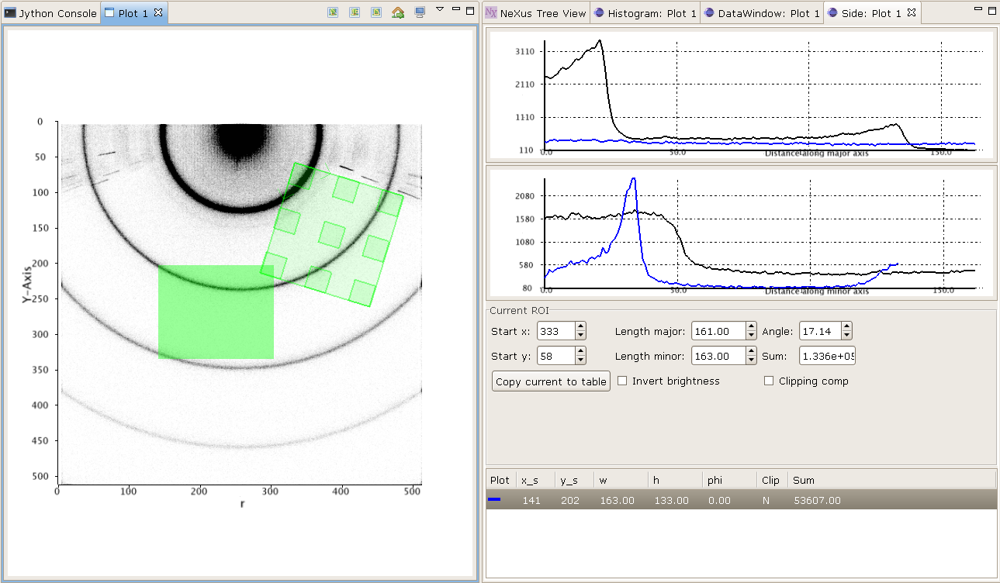

Plot view
=========
The plot view is the main window where all graphical plotting is displayed.
A plot view is a generic plotting UI, that allows graphical plotting of different
scalar dataset types. Currently supported scalar plots are:

 * multiple 1D scalar as lines

  .. figure:: images/plot1d.png

 * multiple 1D scalar as a series of lines in 3D

  .. figure:: images/plot1d_3d.png

 * multiple 1D scalar as points in 2D

  .. figure:: images/pplot2d.png

 * multiple 1D scalar as points in 3D

  .. figure:: images/pplot3d.png

 * 2D scalar as image

  .. figure:: images/plot2d.png

 * 2D scalar as 3D surface plot
 
  .. figure:: images/plot2d_surf.png

It is possible to have more than one plot view open and plot to them
simultaneously and usually they are named Plot 1, Plot 2, ..., Plot n. The name
is important since it is used to send data to via the Jython terminal.

Plotting any data in any form to one of the plot views can be done using the
plotting package:

 * 1D scalar line plots::

    import scisoftpy as dnp
    
    dnp.plot.line([x,] y, title=None)

   plots the given ``y`` value dataset or list of datasets against a ``x`` dataset or list of
   datasets (if given). If a single ``x`` dataset is given, then it used for all ``y`` datasets
   and if a list of ``x`` datasets is given then it used in a pairwise fashion with the
   corresponding ``y`` datasets.

   As well as passing datasets, a plot title can be set using the title keyword. Furthermore,
   alternative axes can be specified per dataset using a single-item dictionary where the key is
   a name or a tuple of name and position. For ``x`` datasets, valid position strings are "top"
   and "bottom" (default); for ``y`` datasets, they are "left" (default) and "right". For
   example, to plot sine and cosine::

    rads = dnp.linspace(0, dnp.pi, 21)
    degs = dnp.linspace(0, 180, 31)
    ysin = dnp.sin(rads)
    ycos = dnp.cos(dnp.radians(degs))
    dnp.plot.line([rads, {"degrees":degs}], [ysin, {("cos","right"):ycos}])

 * multiple 1D scalar line plots as 3D series::

    dnp.plot.stack([x,] y, z=None)

   plots all of the given 1D ``y`` datasets against corresponding ``x`` (if given) as a
   3D stack with specified ``z`` coordinates
 
 * 2D scalar image plots (also 2D compound datasets such as RGB datasets are supported and shown in colour)::

    dnp.plot.image(image, x=None, y=None)

   plots the 2D dataset as an image

 * 2D scalar points plots::

    dnp.plot.points(x, y, size=0)

   plots the points defined by ``x`` and ``y`` datasets. ``size`` can be a number or a dataset
   and defines the size of each point plotted

 * 2D scalar 3D surface plots::

    dnp.plot.surface(data, x=None, y=None)

   plots the 2D dataset as a surface

 * 3D scalar points plots::

    dnp.plot.points(x, y, z, size=0)

   plots the points defined by ``x``, ``y`` and ``z`` datasets. ``size`` can be a number or a dataset
   and defines the size of each point plotted. The colours of each point depends on its size and the
   colour mapping used

By default, these functions send data to Plot 1. This default can be changed using::

    dnp.plot.setdefname('Plot 2')

Otherwise, data can be sent to other plot views on a plot-by-plot basis using
the optional keyword argument, ``name``. For example::

    dnp.plot.line(y, name="Plot 2")

In line and points plots, more lines or points can be added with::

    dnp.plot.addline([x,] y)
    dnp.plot.addpoints(x, y, z=None, size=0)

Both 2D image plots, 2D surface plots and 3D points plots will open
automatically a histogram view panel that is associated to the plot view.
Through the histogram view it is possible to control the mapping of the data
values in the plotted image or surface to the different colours.

.. figure:: images/histogram.png

Finally, a plot view can be cleared::

   dnp.plot.clear()

which can take an optional ``name`` argument.

2D Image Plot Profiles
----------------------
The plot profile tools inhabit a side plot panel. The tools are activated by
clicking on the toolbar buttons in the plot view. These buttons become visible
when an image is plotted.

The coordinate system used in the image plot is in pixels starting from the
upper left at (0,0) with *x* increasing when moving left and *y* increasing
moving down. Angles are measured from the horizontal and increases when moving
clockwise.

There are three profile tools: line, box and sector tools. Each allows the
selection of multiple regions of interest (ROIs). The purpose of the ROIs is
to allow profiles of the image within a ROI to be plotted. These plots reside
in the top part of the panel. Note, for compound datasets, only the first
element of each item is analysed by the profile tools. In the case of coloured
images, the red channel is profiled. 

.. figure:: images/lprof01.png

   Line profile tool

When a profile tool is active, a region of interest can be specified using the
mouse to click and drag out a ROI. The ROI is shown as an overlay on the
image. Once done, the ROI can be further manipulated with use of its handle
areas. The brightness of the ROI outline can be inverted using the
"Invert brightness" checkbox to improve its contrast with the image.

The handle areas operate in two ways: a left click on an area enables that
area, and the part of the ROI to which it is attached, to be moved; a right
click (or alternatively, simultaneous holding a shift key and left clicking)
cause some type of rotation to occur. Generally, a central handle area allows
translation of the ROI  or rotation about that handle area. A handle area at a
vertex will allow resize of the ROI (leaving the opposing vertex fixed) or
rotate about the opposite vertex.

Once a profile is plotted, it can be added to a store using a toolbar button
above the plotting area. The oldest item in the store also can be removed using
a toolbar button. There are separate stores for each type of profile.

Each linear ROI can have an optional cross, linear ROI defined to form a
cross-hair. This cross ROI is a perpendicular bisector of the same length as its
partner. The line profile is plotted in the graph and dashed lines are used for
cross ROIs.

   Box profile tool

A rectangular ROI defined in the box profile tool is defined by its starting
point, width (major axis length), height (minor axis length) and orientation
angle of its major axis. The upper graph shows the integration values over
the minor axis as the position on the major axis is varied. The lower graph
shows the converse. There is a "clipping comp" checkbox available that attempts
to compensate for the situation where a ROI lies partially outside the image,
i.e. the ROI is clipped by the boundaries of the image. In this case, some of
the integration values are subdued by the lack of pixels (they are represented
by zeros in the ROI) outside the image and the compensation scheme boosts those
values by the ratio of the full integration length to the clipped length. Note
that this compensation can introduce extrapolation errors and is prone to
erroneous results where the clipped length is short and when the pixel values
are noisy. 

The sector ROI is distinguished by the necessity of defining a centre point.
Once defined, the sector ROI operates in a manner dictated by a polar
coordinate system (radius *r*, angle *phi*) so rotation operations on the
handle areas act like translations in polar coordinates. Also, the angular
symmetry can be selected for a sector ROI that can alter the ROI or make a 
copy subject selected symmetry:

 *None*
  No symmetry
 *Full*
  360 degrees
 *L/R reflect*
  Left/right reflection
 *U/D reflect*
  Up/down reflection
 *+90*
  Rotate 90 degrees clockwise
 *-90*
  Rotate 90 degrees anti-clockwise
 *Invert*
  Invert through centre

The upper graph shows the azimuthal integration as the radius is varied and the
lower graph shows the radial integration as the azimuth angle is changed.
Ticking the "combine symmetry" checkbox allows any separate symmetry-selected
ROI to be combined in the profile plots, otherwise the separate ROI is plotted
as dashed lines.

The current ROI can also be modified using the spinner widgets that are
displayed in the centre part of the side plot panel. Each spinner is editable
and can alter a parameter of the ROI. Once the ROI has been defined, it can be
saved and then displayed in the table at the bottom of the panel.

.. figure:: images/sprof01.png

   Sector profile tool

Multiple ROIs can have their profiles plotted by clicking on the checkboxes in
the table. Any ROI in the table can be selected and replace the current ROI,
copied in place of the current ROI or deleted using a right mouse click
anywhere on the row of the ROI.

All profile plots allow zooming using the left-hand mouse button to drag out
a rectangular area to magnify. A right-hand mouse button click brings up a
dialogue box where there are buttons for switching between linear and
logarithmic scales on the ``y`` axis, undoing previous zooms and resetting the
plot. The initial choice of y axis scale used in all the profile plots is
controlled by the setting found within
:menuselection:`&Window --> &Preferences --> Scisoft Settings --> Side Plotter`.

Plot GUI information
--------------------
GUI information from interactions with the plot view and side panels can be
passed back and forth from the view to the Jython console.

The plot client regularly updates the console with GUI information. This
can be obtained using the plotting package::

    import scisoftpy.plot as dpl
    
    # grab a GUI bean
    gb = dpl.getbean()

By default, this function returns information as a ``bean'' from Plot 1 - use
the keyword argument ``name`` to obtain information from other named plot
views. Again, the default view name can be changed with ``dpl.setdefname``.
The GUI bean is a dictionary object with a set of possible keys listed in the
GUI parameters class. :obj:`None` is returned if there is no dictionary
present. You can add in new entries or overwrite existing ones. Modified GUI
beans can be pushed back to a plot view::

    dpl.setbean(gb)

and the view will respond appropriately to the updated GUI information. The
keys for the dictionary are listed as strings in the GUI parameters class::

    dir(dpl.parameters)

ROI objects
-----------
The regions of interest defined are in the ROI package::

  import scisoftpy.roi as droi

These are

 *point*
   A single point defined by its coordinates (Python attributes: *point*)
 *line*
   A line segment defined by its starting point, length and angle (*point*, *length*, *angle*, *angledegrees*)
 *rectangle*
   A rectangle defined by its starting point, width, height and 
   angle (*point*, *lengths*, *angle*, *angledegrees*)
 *sector*
   A sector defined by its centre point, bounds on radius and azimuthal angle (*point*, *radii*, *angles*, *anglesdegrees*)
 *circle*
   A circle defined by its centre point and radius (*point*, *radius*)
 *ellipse*
   An ellipse defined by its centre point, major and minor semi-axes and azimuthal angle (*point*, *semiaxes*, *angle*, *angledegrees*)

They also possess *name* and *plot* attributes where the latter is a boolean
and is used to determine whether to plot the profile when in the correct GUI
view. These attributes can be used as keywords in constructing the ROIs::

    import scisoftpy as dnp
    p = dnp.roi.point() # creates a point ROI with default values
    p.name = 'point 1'
    p.point = 50,-50

    # using keyword arguments in the constructor to create the same ROI
    p = dnp.roi.point(name='point 1', point=[50,-50])

As mentioned in the previous section, the current ROI and any ROIs stored
in the table are sent via a GUI bean back to the plot view.

The current ROI and the table of ROIs are held in the GUI bean. The values
held under those keys depend on which side panel is active.

When the line profile tool is being used, the item in the bean is a linear ROI
object and any stored ROIs are held in a Python list/dictionary of linear ROIs::

    cr = dpl.getroi(gb)

    # print current ROI's starting point, length and angle (in radians)
    print cr.point, cr.length, cr.angle

    lr = dpl.getrois(gb)

    # get first item
    ra = lr[0]

    print ra.length, ra.angleDegrees

    # copy ROI from list
    roi = dpl.getrois(gb)[0].copy()

    # assign name
    roi.name = 'New line'

    # modify ROI
    roi.point = 100,50

    # delete ROI from bean
    dpl.delroi(gb)

    # delete rectangular ROI (if exists) from bean
    dpl.delroi(gb, dpl.roi.rect)

    # delete list of ROIs from bean
    dpl.delrois(gb)

    # delete list of sector ROIs (if exists) from bean
    dpl.delrois(gb, dpl.roi.sector)

    # import region of interest package
    import scisoftpy.roi as droi
    list = droi.line_list()
    list.append(roi)
    dpl.setrois(gb, list)

    # push bean back
    dpl.setbean(gb)

Note, ROIs must be assigned names before they are appended to a ROI list.

For convenience, the step of obtaining the GUI bean can be omitted::

    # get current ROI directly from default plot view
    r = dpl.getroi()

    # get current ROIs directly from named plot view
    rs = dpl.getrois(name="Plot 2")

    # get current linear ROIs directly from named plot view
    rs = dpl.getlines(name="Plot 2")

    # set and send ROI directly to default plot view
    dpl.setroi(r)

    # set and send ROIs directly to named plot view 
    dpl.setrois(rs, name="Plot 2")

    # delete linear ROIs from named plot view
    dpl.delrois(roi=dnp.roi.line, name="Plot 2")

The ROIs obtained from the client can be used with image datasets to calculate
profile datasets in the console::

    # for a linear ROI lroi, image dataset and a step size of 0.5 pixels,
    # lprof is a list of datasets. The first element is the profile along the
    # line and the second element is along the perpendicular bisector (if the
    # crosshair option is set)
    lprof = droi.profile(image, lroi, step=0.5) 

Managing Plot Views
-------------------
Existing plot views can be shown by opening the :menuselection:`&Window --> Show Plo&t View`
sub-menu and selecting the named plot view.

New plot views can be opened using the :menuselection:`&Window --> Show Plo&t View --> New Plot View`
menu to create new plot views that are named to continue the sequence ``Plot 1``, ``Plot 2``, etc.

There is a way to control plot views from Python using the window manager::

    import scisoftpy as dnp

    # returns a list of open plot views
    dnp.plot.window_manager.get_open_views()

    # open a named plot view or an automatically generated unique name
    # and returns that name
    dnp.plot.window_manager.open_view(view_name=None)

    # copies the named plot view with its data and GUI beans and returns the new name
    dnp.plot.window_manager.open_duplicate_view(view_name)

